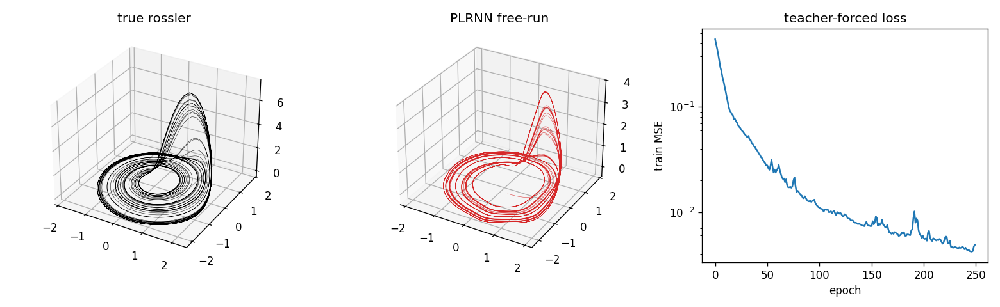
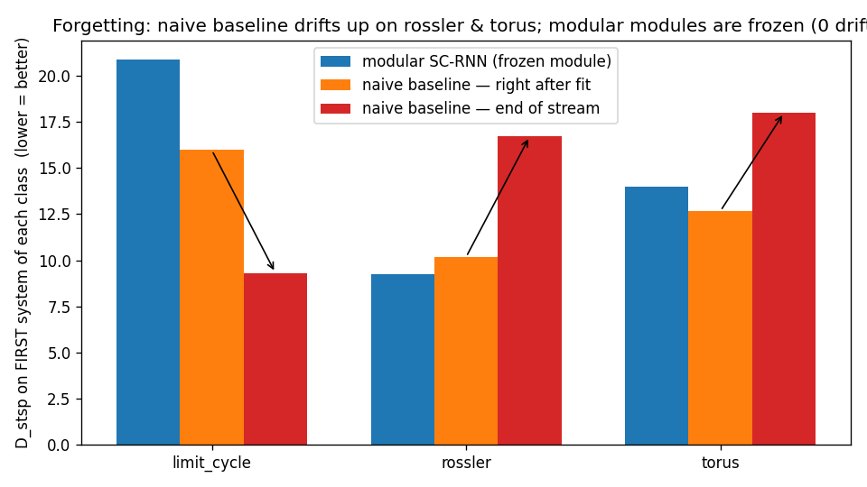
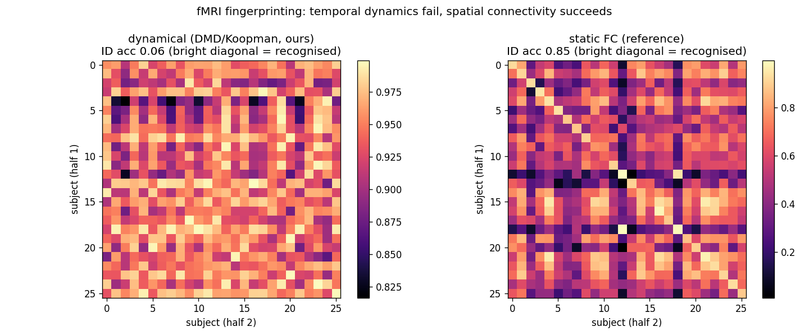

# schemata — schema learning in dynamical-systems reconstruction

Building **"schemata" and "analogies" into dynamical-systems models** for neuroscience time series:
reconstruct a system's dynamics, encode it as a gauge-free **schema signature**, and — over a stream of
systems — decide at training time whether to **reuse** a known schema (*assimilate*) or **allocate** a
new one (*accommodate*).

> Start here: **[summary.md](summary.md)** (what we learned, caveats, future work) and
> **[SC_RNN.md](SC_RNN.md)** (the model, math, experiments). Theory: [primer.md](../primer.md).

---

## Highlights

**Reconstruction (DSR).** A clipped Almost-Linear RNN + generalized teacher forcing reconstructs the
Rössler attractor with the correct chaotic signature (Kaplan–Yorke dim **2.007** vs true ≈ 2.01).
Topological complexity — not chaos per se — is the axis of difficulty (Lorenz's two wings stay hard).



**Continual learning.** On a stream of distinct systems, the schema memory allocates exactly the right
number of schemas and reuses them — with **zero forgetting** (frozen modules) where a naive single model
**forgets 2/3 of the classes**.



**Real neural data — the key finding.** On the lab's fMRI (Koppe et al. 2019), a temporal **dynamical**
signature fails to fingerprint subjects (0.06 ≈ chance) while **spatial functional connectivity**
succeeds (0.85). In short/noisy neural data the schema-relevant information is largely *spatial/geometric*
— a temporal-dynamical signature alone misses it.



---

## Layout

| | |
|---|---|
| `systems.py` | chaotic/periodic systems, within-class variants, PCA canonicalisation, CL stream |
| `plrnn.py`, `alrnn.py` | PLRNN / Almost-Linear RNN + generalized-teacher-forcing trainer |
| `metrics.py` | invariant DSR metrics (D_stsp, power spectrum, Lyapunov spectrum, Kaplan–Yorke) |
| `embeddings.py` | gauge-free schema signature: Koopman ⊕ symbolic ⊕ dynamical channels |
| `schema_memory.py` | prototype memory + attention + assimilate/accommodate (leader clustering) |
| `cl_run.py` | the continual-learning stream + evaluation |
| `run_e0.py` | single-system reconstruction |
| `neuro_eegbci.py`, `neuro_fmri.py` | real-data tests (EEG via MNE; lab fMRI) |
| `*.md` | [summary.md](summary.md), [SC_RNN.md](SC_RNN.md), [dsa_native_ssm.md](dsa_native_ssm.md), [experiments_00.md](experiments_00.md) |

The lab fMRI BOLD data is **not committed** (`data_fmri/` is gitignored) — fetch it from
[DurstewitzLab/PLRNN_SSM](https://github.com/DurstewitzLab/PLRNN_SSM); see [summary.md](summary.md) §6.

## Quickstart

```bash
pip install torch numpy scipy matplotlib scikit-learn mne

python run_e0.py --system rossler --alpha 0.15   # reconstruct an attractor
python cl_run.py --mode probe                    # schema-signature separability
python cl_run.py --mode cl --tau 2.05            # the continual-learning stream
python neuro_fmri.py                             # fMRI fingerprinting (needs data_fmri/)
```

## State of play

The schema-CL machinery is sound (correct allocation, reuse, zero forgetting), but every claim is gated
by (a) **reconstruction fidelity** on synthetic data and (b) the fact that on real neural data the
schema-relevant information is substantially **spatial/geometric**. Next decisive step: a geometry-aware,
**input-driven** signature on the lab's own fMRI — not more temporal-dynamical channels. See
[summary.md](summary.md) §7.
