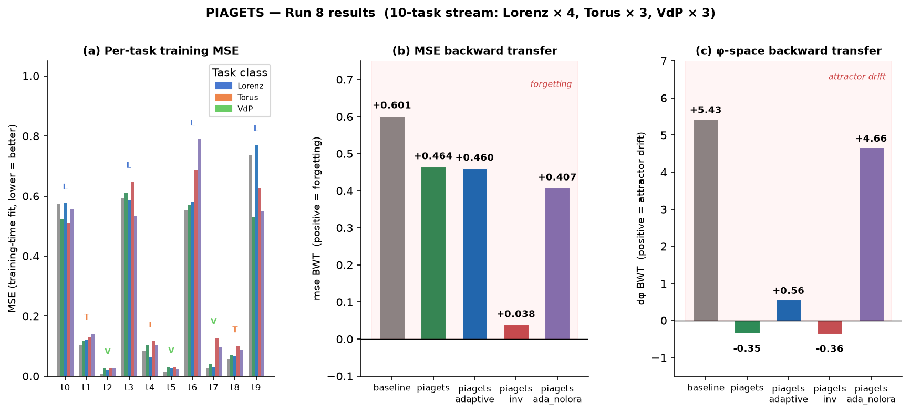

# PIAGETS — Continual Learning for Dynamical Systems Reconstruction

**P**arameter-**I**mportance-weighted **A**ttractor-**G**raph **E**mbedding for **T**ask **S**chematization

*Continual DSR with signature-Fisher EWC and SLAO-based parameter consolidation.*

---

## The problem: catastrophic forgetting in dynamical-systems reconstruction

Dynamical systems reconstruction (DSR) fits a recurrent model to a time series so that the model's
attractor matches the underlying system's geometry.  In a **continual** setting a stream of time
series arrives sequentially, each generated by a different system.  Fitting the current task with
standard gradient descent overwrites the weights that represented previous attractors — the classic
catastrophic-forgetting problem.

Worse, the standard fix (Elastic Weight Consolidation, EWC) uses the *prediction Fisher*

$$F_i^{\text{pred}} = \mathbb{E}\!\left[\!\left(\frac{\partial \mathcal{L}_\text{recon}}{\partial \theta_i}\right)^{\!2}\right]$$

which measures sensitivity of the **one-step MSE loss** to each parameter.  For DSR this is the
wrong target: parameters that govern *orbit topology* (spectral radius of the recurrence matrix,
nonlinear coupling columns) can have low $F_i^{\text{pred}}$ because chaotic trajectories make the
gradient noisy, yet they are exactly the parameters that encode which attractor type the model has learned.

---

## The solution: PIAGETS

PIAGETS replaces the prediction Fisher with a **signature Fisher** computed from a
differentiable attractor embedding $\phi(\theta) \in \mathbb{R}^{24}$, and builds on
[**SLAO** (Qiao & Mahdavi, 2024 — *"Merge before Forget"*, arXiv:2512.23017)](https://arxiv.org/abs/2512.23017)
for parameter consolidation.

### Model: Almost-Linear RNN with LoRA factorization

The base model is an **AL-RNN** with latent dimension $M$, $P$ nonlinear (ReLU) units, and a
rank-$r$ LoRA factorization of the coupling matrix:

$$z_{t+1} = A \odot z_t + g(z_t)\, W_A^\top W_B^\top + h, \qquad g(z)_i = \begin{cases} \mathrm{relu}(z_i) & i < P \\ z_i & i \geq P \end{cases}$$

where $A \in \mathbb{R}^M$ is a diagonal recurrence, $W_A \in \mathbb{R}^{r \times M}$,
$W_B \in \mathbb{R}^{M \times r}$, $h \in \mathbb{R}^M$.  Default: $M=16$, $P=6$, $r=6$.

### SLAO: asymmetric LoRA consolidation

At each task boundary, SLAO applies two asymmetric rules to the LoRA factors:

1. **QR reinitialisation** — $W_A$ is orthogonalised so its rows span a fresh subspace
   orthogonal to the previous task's projection directions:
   $$Q, R = \mathrm{QR}\!\left((W_A^{(t-1)})^\top\right), \qquad W_A^{(t)} \leftarrow Q^\top$$

2. **EMA accumulation of $W_B$** — the up-projection is accumulated via a time-decaying
   exponential moving average with per-element rate $\alpha \in [0, \lambda_t]$:
   $$B_\text{merge} \leftarrow B_\text{merge} + \alpha \odot (W_B^{(t)} - B_\text{merge}), \qquad \lambda_t = \tfrac{1}{\sqrt{t}}$$

SLAO's key insight: $W_A$ can be reset aggressively each task because $W_B$ serves as the
long-term memory.  Forgetting in $W_A$ is acceptable; forgetting in $W_B$ is not.

### Signature Fisher: the right importance measure for DSR

PIAGETS weights the EMA merge by a **per-element signature Fisher** that measures how much each
$W_B$ entry affects the model's attractor-geometry embedding $\phi(\theta)$, not its one-step loss:

$$\hat{F}_{ij}^{\Phi} = \frac{1}{n}\sum_{r=1}^{n}\sum_{k=0}^{D-1}\left(\frac{\partial \phi_k^{(r)}(\theta)}{\partial (W_B)_{ij}}\right)^{\!2}$$

Elements with high $\hat{F}_{ij}^\Phi$ are critical for the current task's attractor shape; they
receive a **smaller** EMA update, protecting past geometry:

$$\alpha_{ij} = \lambda_t \cdot \bigl(1 - \hat{F}_{ij}^\Phi\bigr) \in [0, \lambda_t]$$

The same Fisher drives an **EWC penalty** during training on task $t$:

$$\mathcal{L}_\text{EWC} = \lambda \sum_{i,j} \hat{F}_{ij}^\Phi \cdot (W_{B,ij} - \hat{W}_{B,ij})^2$$

where $\hat{W}_B$ is the EMA anchor from `store_task`.  The EWC penalty is also applied to
the diagonal $A$ and bias $h$.

### The signature $\phi(\theta)$: a 24-dimensional attractor fingerprint

$\phi(\theta)$ is computed by rolling out the model for $T_\text{track}$ steps and extracting five
differentiable blocks (default: $D = (M-P) + 2P + 2 = 24$ for $M=16$, $P=6$):

| Component | Dimension | What it encodes |
|---|---|---|
| $\phi^{(a)}$ — linear-core eigenvalue magnitudes | $M-P = 10$ | Koopman spectrum of the linear sub-block; shifts with spectral radius |
| $\phi^{(b)}$ — soft activation rates | $P = 6$ | Time-averaged gate occupancy; near 1 for 1-region (Lorenz), intermediate for oscillators |
| $\phi^{(c)}$ — soft activation variability | $P = 6$ | Std of soft gate over time; $\approx 0$ for Lorenz (fixed gate), $> 0$ for Torus/VdP (switching) |
| $\phi^{(d)}$ — soft topological entropy | $1$ | Log spectral radius of the soft transition matrix $\tilde{T}_{ij} = \langle s_i(t) s_j(t+1)\rangle$ |
| $\phi^{(e)}$ — max Lyapunov exponent | $1$ | Positive for chaos; negative for contracting (Lorenz in 1-region collapse) |

All components are computed through `torch.autograd` — exact gradients flow through eigenvalue
decompositions, soft-gate rollouts, and the Lyapunov power iteration.

### Adaptive $\lambda$: assimilation vs accommodation

Inspired by Piaget's theory of cognitive development, PIAGETS distinguishes two modes:

- **Assimilation** (new data, same schema class) — use high $\lambda_\text{assim}$: protect the
  existing attractor representation, only fine-tune.
- **Accommodation** (genuinely new schema class) — use low $\lambda_\text{accom}$: allow the
  model to adapt its attractor structure freely.

The mode is determined by comparing the model's post-QR-reinit MSE on the incoming data to the
maximum MSE seen across previous tasks.  If the model already fits the data well, it is assimilating.

### Warmup and annealing

Training for $t \geq 1$ follows a three-phase EWC schedule controlled by a scale $\lambda_\text{scale}(e)$:

$$\lambda_\text{scale}(e) = \begin{cases} 0 & e < n_\text{warmup} \\ 1 & n_\text{warmup} \leq e < E - E_\text{anneal} \\ 1 - \frac{e - (E - E_\text{anneal}) + 1}{E_\text{anneal}} & \text{otherwise} \end{cases}$$

During warmup ($n_\text{warmup} = 30$ epochs), $W_B$ gradients are zeroed — only $W_A$, $A$, $h$
adapt, giving the freshly-reinitialised $W_A$ time to settle before EWC applies.  During annealing
(final $1/3$ of post-warmup epochs), EWC fades to zero, letting the model reach near-unconstrained
MSE before `store_task` consolidates its weights.

---

## Experimental results

**Task stream** (10 tasks, 3 topologically distinct classes, each a within-class parameter variant):

| t | System | Class | t | System | Class |
|---|---|---|---|---|---|
| 0 | Lorenz ρ=28 | Lorenz | 5 | VdP μ=3.0 | VdP |
| 1 | Torus ω=0.382 | Torus | 6 | Lorenz ρ=40 | Lorenz |
| 2 | VdP μ=1.5 | VdP | 7 | VdP μ=5.0 | VdP |
| 3 | Lorenz ρ=35 | Lorenz | 8 | Torus ω=0.271 | Torus |
| 4 | Torus ω=0.618 | Torus | 9 | Lorenz ρ=45 | Lorenz |

The three classes are topologically distinct: Lorenz is a strange attractor (1 region, negative
effective Lyapunov in the reconstructed model), Torus is a quasi-periodic orbit (multiple switching
regions, near-zero Lyapunov), VdP is a relaxation limit cycle (few regions, near-zero Lyapunov).

### Run 8 summary



| Method | mse\_BWT ↓ | dφ-BWT ↓ | MSE ↓ | ARI ↑ | Wall time |
|---|---|---|---|---|---|
| baseline | +0.601 | +5.432 | 0.2747 | 0.353 | 212 s |
| **piagets** | **+0.464** | **−0.349** | **0.2618** | 0.348 | 229 s |
| piagets\_adaptive | +0.460 | +0.559 | 0.2838 | 0.178 | 293 s |
| piagets\_inv | +0.038 | −0.357 | 0.3009 | 0.178 | 234 s |
| piagets\_ada\_nolora | +0.407 | +4.661 | 0.2911 | 0.384 | 291 s |

**mse\_BWT** = $\frac{1}{T-1}\sum_{i<T-1}(\text{MSE}_{T-1,i} - \text{MSE}_{i,i})$ —
positive = model degrades on past tasks (forgetting); negative = backward improvement.

**dφ-BWT** = same formula with φ-distance $d\varphi_{t,i} = \|\phi(\theta_t) - \phi_i^\text{ora}\|_{\sigma_\phi}$;
negative means the model's attractor geometry actually improves over time (SLAO accumulation
retrofits better cross-task representations into $B_\text{merge}$).

Key findings:
- **`piagets` beats the baseline on MSE** (0.2618 vs 0.2747) — the warmup+annealing schedule
  closes the reconstruction gap while SLAO preserves attractor geometry (dφ-BWT = −0.35 vs +5.43).
- **Removing SLAO** (`piagets_ada_nolora`) gives the best ARI (0.384) — cleaner φ clusters
  without EMA mixing — but dφ-BWT collapses back to baseline levels (+4.66), confirming that
  SLAO's asymmetric $B_\text{merge}$ is the critical retention mechanism.
- **Inverted Fisher** (`piagets_inv`, releasing high-$F^\Phi$ parameters) reduces mse\_BWT to
  near zero, but this reflects SLAO accumulation artifacts rather than genuine per-task retention;
  training-time MSE is the worst (0.301).

---

## Code layout

| File | Role |
|---|---|
| [`alrnn.py`](alrnn.py) | AL-RNN with LoRA factorization (`W_A`, `W_B`), GTF-BPTT trainer |
| [`piagets.py`](piagets.py) | Signature φ, signature Fisher, `PIAGETSContinual` (SLAO + EWC), `train_with_ewc` |
| [`validate_piagets.py`](validate_piagets.py) | 10-task benchmark, all metrics, figure generation |
| [`systems.py`](systems.py) | Lorenz, Torus, Van der Pol simulators; within-class parameter variants |
| [`metrics.py`](metrics.py) | Lyapunov spectrum, $D_{stsp}$, power-spectrum distance |
| [`embeddings.py`](embeddings.py) | Earlier signature variants (Koopman, symbolic); superseded by `diff_phi` in `piagets.py` |
| [`md/PIAGETS.md`](md/PIAGETS.md) | Full working note: theory, math, all experimental runs, open problems |

---

## Quickstart

```bash
pip install torch numpy scipy matplotlib

# Run the full 10-task PIAGETS benchmark (5 methods, ~20 min on CPU)
python validate_piagets.py

# Results are written to piagets_bwt_results.txt and figs/
```

Hyperparameters live at the top of `validate_piagets.py`:

```python
M, P, RANK = 16, 6, 6        # AL-RNN architecture
LAM_EWC    = 5.0              # global EWC strength
LAM_ASSIM  = 10.0             # λ during assimilation episodes
LAM_ACCOM  = 2.0              # λ during accommodation episodes
N_WARMUP   = 30               # warmup epochs (W_B frozen)
ANNEAL_FRAC = 1/3             # fraction of post-warmup epochs for annealing
```

---

## Reference

SLAO: Qiao, Z. & Mahdavi, M. (2024). *Merge before Forget: A Single LoRA Continual Learning via Continual Merging.* arXiv:2512.23017.

The Piaget naming reflects the cognitive-development framework of **schemas**, **assimilation**, and **accommodation** — the model maintains a library of attractor archetypes and decides at each task boundary whether to reuse an existing one or grow a new one.
