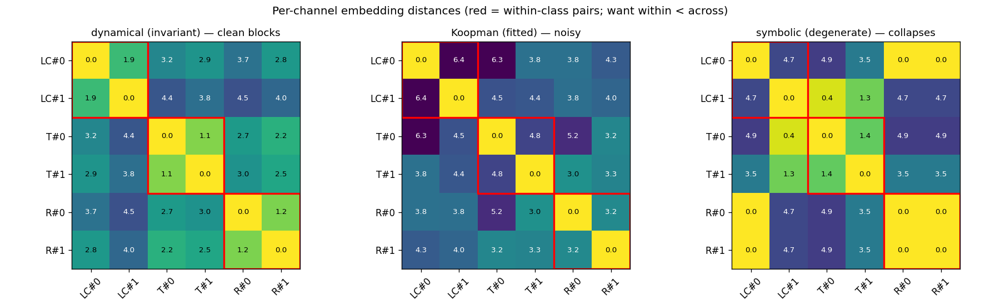
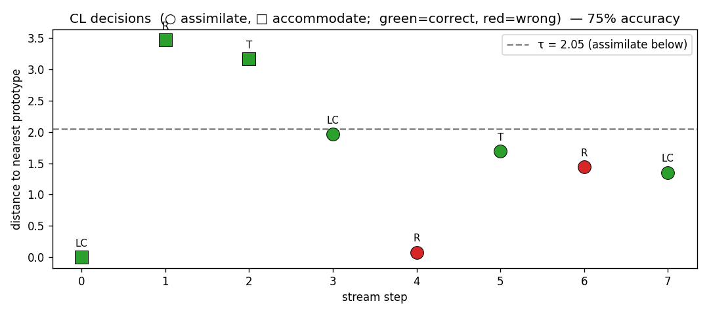

# SC-RNN (Schema Comparator RNN)

*A continual-learning architecture that reconstructs dynamical systems, encodes each as a
gauge-free schema signature, and decides — at training time — whether a new system reuses a known
schema (assimilate) or needs a new one (accommodate). This document describes the model, the math,
the code, and the experiments, including an honest accounting of what it currently buys versus a
naive baseline.*

Companion docs: [primer.md](primer.md) (theory), [experiments_00.md](experiments_00.md) (E0
reconstruction experiments), [dsa_native_ssm.md](dsa_native_ssm.md) (design notes & run logs).

---

## 0. The task

The supervisor's brief: *"build something like 'schemata' and 'analogies' into dynamical systems
models, or identify principles that foster that,"* with the target domain being **time-series data
in neuroscience**. We operationalise it through the lab's **Dynamical Systems Reconstruction (DSR)**
program: a *schema* is an **equivalence class of dynamical systems** (systems that are "the same kind"
up to a chosen group of nuisance transformations 𝒢 — coordinate changes, time rescalings, noise;
[primer.md](primer.md) §1.2, §4.2), together with a chart over the class.

The concrete objective is **continual learning, Setting A** ([primer.md](primer.md) §4.1): a stream
of datasets `D₁, D₂, …` from distinct systems `F₁, F₂, …` arrives; we fit **one** model sequentially
and must, *at training time*, make the **assimilate-vs-accommodate** decision:

$$k^* = \arg\min_k\, d\big(\Phi(F_{\text{new}}),\,c_k\big),\qquad
\begin{cases} d < \tau: & \textbf{assimilate (reuse schema }k^*) \\ d \ge \tau: & \textbf{accommodate (new schema)}\end{cases}$$

where `Φ` is a learned embedding of a system's dynamics, `{c_k}` are stored schema prototypes, and `d`
a metric. Success = no forgetting + correct reuse/allocate decisions against ground-truth conjugacy.
Forecast accuracy is explicitly **not** the criterion; reconstruction is judged by dynamical
invariants ([primer.md](primer.md) §3.1, §3.5).

---

## 1. Desiderata (from the task and the math)

| # | Desideratum | Where it comes from |
|---|---|---|
| D1 | **Reconstruct the dynamics**, judged by invariants (attractor geometry, Lyapunov spectrum, dimension), not forecasts. | DSR definition; chaos caps prediction horizon. |
| D2 | **A signature `Φ` that is invariant within a schema and discriminative across** — i.e. it factors through the quotient `𝒮/∼_𝒢`. | The schema = equivalence class. A comparator must quotient the nuisance group 𝒢 (here: coordinate/affine changes), or "same system, different frame" reads as "different". |
| D3 | **The signature must be gauge-free** in the model's own latent coordinates: two fits of the same system land in different latent bases `T K T⁻¹`, so raw weights are incomparable. | Latent reparametrization gauge ([dsa_native_ssm.md](dsa_native_ssm.md) §0). |
| D4 | **Decide assimilate/accommodate at training time**, allocating new capacity only when needed. | Setting-A CL; the §4.4 decision rule. |
| D5 | **No catastrophic forgetting** of earlier schemas. | CL core requirement. |
| D6 | **Interpretability / a readable dynamical skeleton.** | Lab's DSR ethos; AL-RNN symbolic codes ([primer.md](primer.md) §3.3). |

The mathematics says no **finite complete invariant** exists for topological conjugacy of chaotic
systems ([primer.md](primer.md) §1.3), so D2 cannot be met exactly. The design response is a
**multi-channel** `Φ` where each channel is a *partial* invariant blind to different things, and which
together separate the classes we care about — tested empirically (D2 becomes "discriminative on the
controlled families", not "complete").

---

## 2. Architecture and training paradigm

SC-RNN is a **modular shared-reader**: a shared embedding+memory controller over a growing set of
per-schema dynamics modules, with a per-system within-class chart. ([dsa_native_ssm.md](dsa_native_ssm.md)
§8.1.)

```
        incoming system Dₛ
               │
   ┌───────────▼────────────┐
   │  canonicalize frame     │  PCA align  (fix rotation/reflection gauge → D3)
   └───────────┬────────────┘   systems.canonicalize
               │
   ┌───────────▼────────────┐
   │  probe AL-RNN module Mₚ │  fit by generalized teacher forcing (D1)
   └───────────┬────────────┘   alrnn.ALRNN + plrnn.train
               │
   ┌───────────▼────────────┐
   │  embed Φ(Dₛ)            │  Koopman ⊕ symbolic ⊕ dynamical, all gauge-free (D2,D3)
   └───────────┬────────────┘   embeddings.embed
               │
   ┌───────────▼────────────┐
   │  attention over {cₖ}    │  softmax(-β d²); assimilate if min d < τ  (D4)
   └─────┬───────────────┬──┘   schema_memory.SchemaMemory
     assimilate       accommodate
   reuse Mₖ, fit       commit Mₚ as new
   chart only          module M_{K+1}; add cₖ
   (no forgetting: committed modules are frozen → D5)
```

### 2.1 The dynamics module — an Almost-Linear RNN (D1, D6)

Each schema module is an **AL-RNN** ([alrnn.py](alrnn.py)): a piecewise-linear RNN with ReLU on only
`P` of `M` latent units, the rest linear:

$$z_t = A\,z_{t-1} + W\,g(z_{t-1}) + h,\qquad
g(z)_i = \begin{cases}\max(0,z_i) & i < P\ \text{(nonlinear units)}\\ z_i & i\ge P\ \text{(linear core)}\end{cases}$$

with `A` diagonal and a state clip `z ← clip(z,±C)` for bounded orbits. Two structural payoffs:
- the **linear core** (`i≥P`) is a Koopman-like operator we read a spectrum off (Koopman channel);
- the **activation pattern** `D_t = (\mathbb 1[z_{1,t}>0],\dots,\mathbb 1[z_{P,t}>0])\in\{0,1\}^P`
  is a **symbol**: the trajectory's pattern sequence is a parsimonious symbolic dynamics over `≤2^P`
  symbols ([primer.md](primer.md) §3.3; Brenner et al. 2024).

The observation model is an identity decoder (first `d` latent dims), so the within-class **chart** is
the PCA canonicalization applied to the data ([systems.py](systems.py) `canonicalize`) — it absorbs
the affine nuisance group 𝒢 (D2, D3) up to a discrete residual.

### 2.2 Training — generalized teacher forcing (D1)

Fit by BPTT with **generalized teacher forcing** (GTF; Hess et al. 2023), implemented in
[plrnn.py](plrnn.py) `train` / [alrnn.py](alrnn.py) `forced_rollout`. Every step the observed latent
dims are pulled toward data by a convex mix,

$$z_t^{\text{inj}} = (1-\alpha)\,z_t^{\text{model}} + \alpha\,z_t^{\text{data}},$$

with `α∈[0.15,0.3]`. GTF keeps BPTT gradients bounded (they otherwise scale like `e^{\lambda t}` for
max Lyapunov `λ>0`), letting us initialise near the dynamical regime without blow-up. An optional
**region-usage regularizer** (`alrnn.region_reg`) maximises per-unit activation entropy
`H(p_i)=-(p_i\log p_i+(1-p_i)\log(1-p_i))`, `p_i=\overline{\sigma(z_i)}`, to discourage degenerate
(never-flipping) ReLU units.

### 2.3 The schema embedding Φ — three gauge-free channels (D2, D3)

[embeddings.py](embeddings.py) reads three channels off a trained module; each is featurised to be
invariant to the latent basis. ([dsa_native_ssm.md](dsa_native_ssm.md) §1.)

- **Koopman (temporal):** sorted eigenvalues `{λ_j}` of the linear-core block `A[P:,P:]+W[P:,P:]`,
  as `(|λ_j|, |\arg λ_j|)`. Eigenvalues are similarity-invariant → basis-free. Captures frequencies
  and decay rates; **blind to global topology, over-sensitive to timescale.**
- **Symbolic (topological):** invariants of the activation-pattern transition matrix `T` (from
  `alrnn.itinerary`): number of symbols, topological entropy `\log\rho(T)`, and periodic-orbit counts
  `\mathrm{tr}(T^n)`. Graph invariants are isomorphism-invariant → gauge-free. Captures attractor
  topology; **needs a faithful (generating) partition.**
- **Dynamical (regime):** model Lyapunov spectrum (QR method on the exact PWL Jacobian
  `J(z)=\mathrm{diag}(A)+W\,\mathrm{diag}(g'(z))`; [metrics.py](metrics.py)
  `lyapunov_spectrum`), Kaplan–Yorke dimension, and `#`positive / `#`zero exponents. These are
  **true dynamical invariants** (coordinate-free). Separates fixed-point / limit-cycle /
  quasiperiodic / chaotic regimes.

### 2.4 The schema memory and decision (D4, D5)

[schema_memory.py](schema_memory.py) holds prototypes `c_k` (running means of assimilated embeddings)
and compares in a **running z-scored space** so heterogeneous channels are commensurate. Distance is
**channel-weighted**,
$$d(q,c_k)^2 = \sum_{\text{ch}} w_{\text{ch}}\,\lVert z_q^{\text{ch}} - z_{c_k}^{\text{ch}}\rVert^2,$$
with attention `a_k = \mathrm{softmax}(-\beta\,d_k^2)` reported as soft membership (`β→∞` recovers the
hard `argmin`; `β,τ` are the boundary-sharpness knobs). Decision: assimilate to `\arg\min_k d_k` if
that distance `< τ`, else accommodate. **Committed modules are frozen** ⇒ forgetting is 0 by
construction (D5). The whole loop is [cl_run.py](cl_run.py) `run_cl`.

---

## 3. Experiments and results

### 3.1 E0 — can the substrate reconstruct an attractor at all? (D1)

We first validated the DSR loop on single systems ([experiments_00.md](experiments_00.md)). All four
classic failure modes appeared and were cured by GTF + contractive init + state clip:

| Setting | Outcome | Failure mode |
|---|---|---|
| `A=0.9`, hard forcing | NaN at init | gradient/forward explosion |
| contractive init, hard forcing | → fixed point | collapse / TF-crutch |
| GTF, no clip, long train | diverged \|z\|~1e29 | unbounded / over-expansive |
| **GTF α=0.15, clip, latent 30** | **chaotic, KY-dim 2.007** | success |

The clean Rössler reconstruction (Lyapunov spectrum `[+0.0018, ~0, −0.038]`, Kaplan–Yorke 2.007 vs
true ≈2.01):


**Key finding feeding the rest:** the shallow substrate reconstructs Rössler (single scroll) cleanly
but **never** the two-wing Lorenz — *topological complexity, not chaos per se, is the axis of
difficulty.*

### 3.2 Probe — is the embedding gauge-free and discriminative? (D2, D3)

Two affine variants per class (limit cycle / torus / single-scroll chaos), embedded, distances
z-scored. Red boxes are within-class pairs (want **within < across**):



- **Dynamical channel: clean.** Within-class ≤ 1.92 < min across-class 2.18 — a real gap. The
  coordinate-invariant channel works.
- **Koopman channel: noisy.** Within-class scatter is large (LC↔LC = 6.4) — fitted-operator
  variability swamps class structure.
- **Symbolic channel: degenerate.** Several modules are *identical* (distance 0) because on
  near-linear systems the ReLU units barely flip → one-symbol itinerary → trivial graph (the
  generating-partition problem).

⇒ v0 decides on the **dynamical channel** (weights `{koopman:0, symbolic:0, dynamical:1}`); the other
channels are extracted and reported but not yet trustworthy.

### 3.3 The CL stream — decisions, reuse, forgetting (D4, D5)

8-system labelled stream, `τ=2.05`. Decisions (○ assimilate, □ accommodate; green correct):



| Metric | Result |
|---|---|
| Decision accuracy | **75%** (6/8) |
| Schemas allocated | **3** for 3 ground-truth classes (no over/under-allocation) |
| Reuse rate | **5/8** systems reused a module |
| Both errors | Rössler→torus (chaos misread as quasiperiodic) |

Forgetting — modular frozen modules vs a naive single AL-RNN fine-tuned through the stream:


The naive baseline **drifts worse on Rössler (10.2→16.7) and torus (12.4→18.0)** as later systems
overwrite it; modular modules are frozen (0 drift). (Caveat, visible in the figure: the modular
limit-cycle module was a poor *absolute* fit (20.9), and naive's limit-cycle — trained last — ended
better; the modular win is **no-drift on 2/3 classes**, not uniform superiority.)

### 3.4 Ablation — region-usage regularizer (negative result)

Adding the entropy regularizer made the ReLU units flip, but the symbolic channel **stayed
non-discriminative** and CL accuracy stayed at 75% with a *worse* failure (only **2 schemas
allocated** — torus collapsed into Rössler). Root cause: **the symbolic signature is downstream of
reconstruction fidelity.** When a small module reconstructs Rössler as a limit cycle (E0's open
problem), its symbolic dynamics is periodic — *identical* to a real limit cycle — so no channel can
place it. A regularizer cannot manufacture chaotic structure the reconstruction lacks
([dsa_native_ssm.md](dsa_native_ssm.md) §8.6).

---

## 4. Discussion and future directions

### 4.1 Are we actually gaining anything over the naive baseline?

**Yes, on two axes; not yet on a third.**

- **No forgetting — a real, structural win.** By freezing committed modules, SC-RNN has *zero* drift,
  while the naive single model degraded 2/3 classes within an 8-system stream (Fig. forgetting). For
  the two chaotic/quasiperiodic classes the frozen module's final quality beats the naive model's.
- **A structured, inspectable schema inventory — a win in kind, not just degree.** SC-RNN ends with an
  explicit set of prototypes and a correct count (3 schemas for 3 classes, no-reg), each reusable; the
  naive model ends as one entangled set of weights with no notion of "which schema". This is the part
  that directly answers the supervisor's brief (schemata *as objects*), and the naive baseline has no
  analogue.
- **Training-compute efficiency — NOT yet won.** This is the honest gap. v0 uses **probe-then-commit**:
  it fits a *full* provisional module for every system, then on `assimilate` discards it and (would)
  fit only the chart. Because we currently fit the full probe regardless, **assimilation saves stored
  parameters and forgetting, but not training FLOPs.** The reuse decision is correct 75% of the time,
  but we don't yet *cash it in* as cheaper training.

**Bottom line:** the schema-memory/CL machinery is sound and buys no-forgetting + an interpretable
schema inventory. The discrimination ceiling (75%) and the unrealised compute savings are both
downstream of one thing — **reconstruction fidelity for chaos** (E0's open problem) — not of the
memory or embedding design.

### 4.2 What are we paying — compute and time complexity?

Let `N` = systems in the stream, `K` = distinct schemas (`K ≤ N`, bounded by #classes), `M` = latent
dim, `n` = trajectory length, `E` = training epochs.

| Stage | Cost (per system unless noted) | Code |
|---|---|---|
| canonicalize | `O(n·d²)` (one eig of 3×3) | `systems.canonicalize` |
| **probe fit (dominant)** | `O(E·n·M²)` BPTT — a *full* module fit, **every system** | `plrnn.train` |
| Lyapunov spectrum | `O(n·M³)` (one `M×M` QR per step) | `metrics.lyapunov_spectrum` |
| itinerary / free-run | `O(n·M²)` | `alrnn.itinerary` |
| Koopman eig | `O(M³)` | `alrnn.linear_core_spectrum` |
| memory query | `O(K·\dim Φ)` — negligible | `schema_memory.query` |
| **stream total** | `O(N·E·n·M²) + O(N·n·M³)` | |
| storage | `K` modules = `O(K·M²)` params | |

Versus the **naive baseline**: one model, `N` fine-tunes of `E'<E` epochs → `O(N·E'·n·M²)`, storage
`O(M²)`. So today SC-RNN pays:
- **≈ the same order in training**, in practice *more* (probe fits are from-scratch at higher `E`),
  plus an `O(n·M³)` embedding overhead per system the baseline doesn't incur;
- **`K×` the storage** (the price of an explicit, non-forgetting schema inventory — bounded by #schemas,
  the intended trade).

The embedding overhead is cheap at `M=16` (`M³` small) but the **probe is the cost centre**, and it is
*exactly* what makes the efficiency case unproven: we compute a full fit to make a decision that, when
it says "assimilate", should have let us *skip* most of that fit.

### 4.3 Future directions (ordered by leverage)

1. **Cheap probe ⇒ realise the compute win.** Compute `Φ` for the *decision* from the data directly
   (EDMD Koopman spectrum + a data-side Lyapunov/dimension estimate) *before* committing to a full
   fit; only fit the chart on assimilate, a full module on accommodate. This converts the correct 75%
   reuse decisions into actual training-FLOP savings — the missing half of the CL value proposition.
2. **Fix chaos reconstruction ⇒ lift the 75% ceiling.** The Rössler↔torus confusion is reconstruction-
   bound (E0). Larger/longer modules (the E0 recipe reached KY 2.007) or a chaos-promoting spectral
   target would give Rössler a genuine positive exponent and non-trivial symbolic graph, at which point
   *both* the dynamical and symbolic channels separate it from the torus.
3. **Make the symbolic channel earn its keep.** Only meaningful once (2) holds: a faithful generating
   partition (canonical-form/whitened operator, [dsa_native_ssm.md](dsa_native_ssm.md) §5) so the
   activation-pattern graph is a stable topological invariant — the channel the dynamical one cannot
   replace (chaos vs quasiperiodicity).
4. **Boundary behaviour = accommodation.** Sweep a parameter through a bifurcation and check the
   decision flips assimilate→accommodate *at* the topological-type change ([primer.md](primer.md)
   §4.4) — the formal "boundary is the hard part."
5. **Shared-vocabulary backbone (Setting C horizon).** Replace per-schema modules with one shared
   reader so activation patterns live in a common vocabulary and recognition becomes in-context /
   online (DynaMix-flavoured) — the version where "use the activation pattern as the query" works
   literally.

### 4.4 One-line honest summary

SC-RNN demonstrates a working assimilate/accommodate controller with **zero forgetting and a correct,
interpretable schema inventory**, but its discrimination (75%) and its training-efficiency case are
both currently **bottlenecked by chaotic-attractor reconstruction**, not by the schema machinery —
so the next decisive work is reconstruction fidelity and a cheap probe, not more comparison channels.
